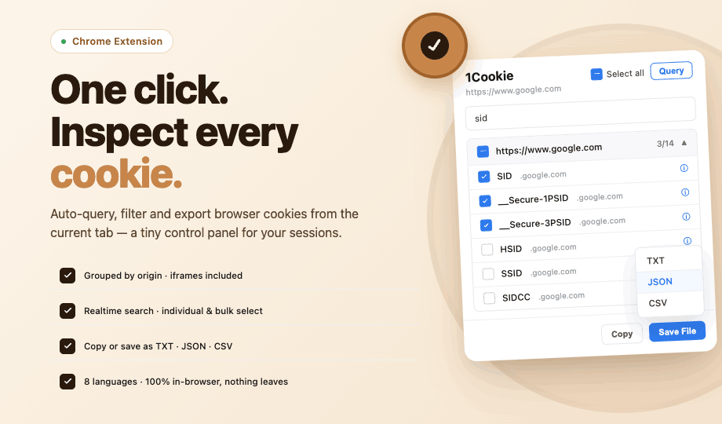

<div align="center">
  
  <h1>1Cookie</h1>
  <p>A Chrome extension to inspect, filter, and export cookies from the current tab.</p>
</div>

---

<div align="center">
 
</div>

### Features

- **Auto Query** — Automatically collects cookies when the popup opens; manual re-query available via the Query button
- **Grouped by origin** — Cookies are grouped by frame origin, including nested iframes
- **Cookie detail** — Click a cookie name or the ⓘ icon to expand value, domain, path, sameSite, secure, httpOnly, session, and expires
- **Expiry warning** — ⌛ badge on cookies expiring within 24 hours
- **Search / Filter** — Real-time filter by cookie name or domain
- **Selection** — Global select-all, per-group select-all (with indeterminate state), and individual selection
- **Copy** — Copy checked cookies to clipboard in TXT, JSON, or CSV format
- **Save to file** — Download checked cookies as `1cookies_yyyy-mm-dd_hh_mm_ss.{ext}` in TXT, JSON, or CSV format
- **i18n** — Supports 8 languages: Korean, English, Simplified Chinese, Traditional Chinese, Japanese, Russian, Indonesian, German

---

### How to Use

1. Open the extension popup on any site — cookies load automatically
2. Click a group header to expand it and see individual cookies
3. Click a cookie name or ⓘ to inspect its full details
4. Check the cookies you want, then use **Copy** or **Save File** to export

---

### Export Formats

| Format | Content |
|--------|---------|
| **TXT** | Block format — `[name]`, `[value]`, `[domain]`, … separated by `---` |
| **JSON** | Full cookie fields as a JSON array grouped by origin |
| **CSV** | Column-based, Excel-compatible |

---

### Permissions

| Permission | Purpose |
|------------|---------|
| `cookies` | Read cookies across all origins |
| `tabs` | Get the current tab's URL and ID |
| `scripting` | Collect origins from all frames including iframes |
| `host_permissions` (`<all_urls>`) | Access cookies across all domains |

---

### Known Behaviors

- Opaque origins (`"null"`) from sandboxed iframes are filtered out and skipped
- When the popup opens, some iframes may not yet be initialized — clicking Query again will pick them up
- No data is stored locally or sent anywhere; all operations are in-memory only

---

### Build

```bash
# Production build
npm run build

# Development (watch mode)
npm start

# Build + zip for store submission → extension/1cookie.zip
npm run build:extension
```

Load the `dist/` folder as an unpacked extension in `chrome://extensions`.

---

### Security Note

Cookies may contain sensitive data such as session tokens. No data leaves the browser — everything is read in-memory via the `chrome.cookies` API and discarded when the popup closes. HttpOnly cookies are accessible only through the extension API and cannot be read by page JavaScript.

---

<a href="https://github.com/wonkyungup/1cookie">GitHub</a>
